# HCTXF 前后端项目架构图（Directus Adapted V2）

- 版本: v2.0（风险收敛版）
- 架构基线: Next.js 15 (App Router) + Directus + MinIO + Postgres + Nginx
- 迁移基线: 旧站 `nd*.html=604`、`col*.html=39`、`nr*.html=21`、栏目签名 `COL_SIG_01~27`
- 优化目标: 降低两大高风险（数据清洗、SEO 迁移），确保上线可回滚、可审计、可观测

## 0) V2 变更摘要

- 新增 `数据质量门禁` 架构图，明确 `dry-run -> 质量阈值 -> 导入/阻断`。
- 新增 `重定向运行时` 架构图，明确 `Nginx 301 优先 + Next old_slug 兜底`。
- 新增 `发布护栏与回滚` 架构图，明确灰度批次、指标阈值和回滚触发。
- 数据模型扩展：`raw_html_backup`、`content_clean`、`migration_status`、`migration_errors`、`legacy_url`。
- SEO 链路强化：全量旧 URL 注册表（664 条）+ 映射覆盖率门禁 + 死链提交。

## 图 1: System Context（系统全景）

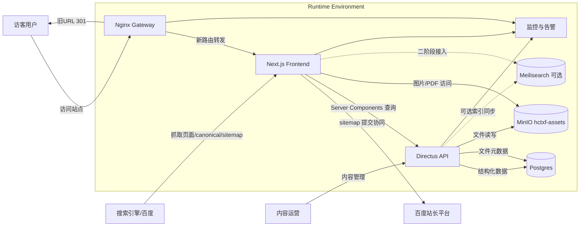

## 图 2: Frontend Project Architecture（前端工程架构）

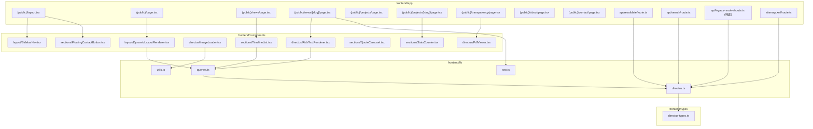

## 图 3: Backend & Storage Architecture（后端与存储）

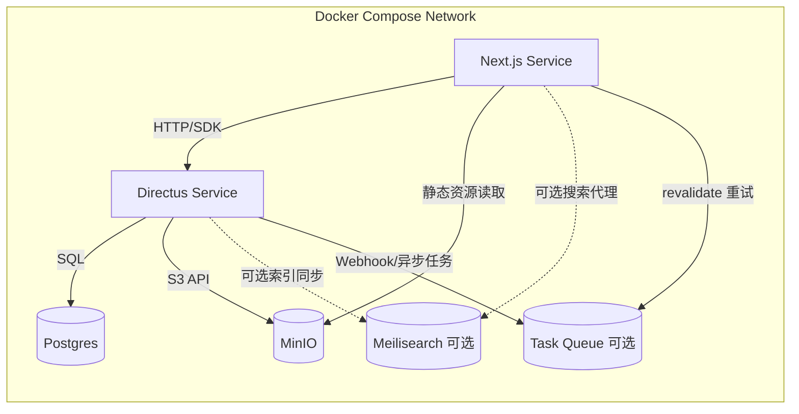

## 图 4: Data Model Mapping（Directus 数据模型映射）

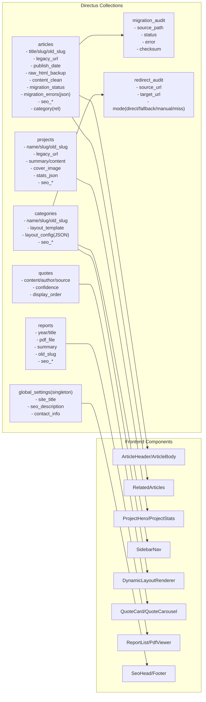

## 图 5: Dynamic Layout Engine（27 签名抽象）

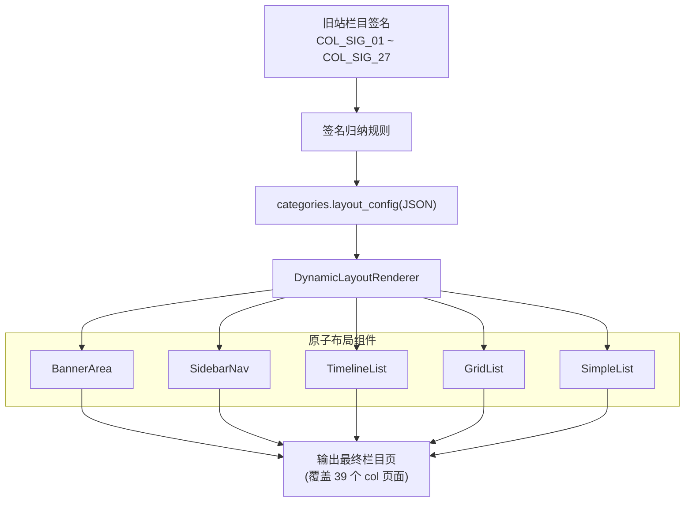

## 图 6: Data Quality Gate（数据质量门禁）

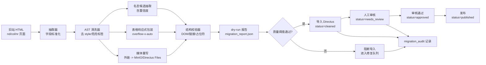

## 图 7: SEO Migration Flow（SEO 平滑迁移）

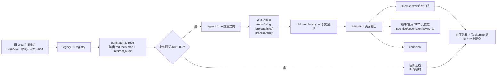

## 图 8: Redirect Runtime（重定向运行时）

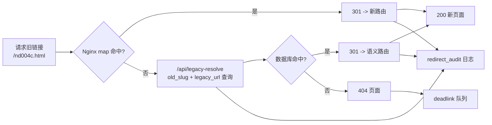

## 图 9: Content Sanitization & Import Pipeline（内容清洗迁移）

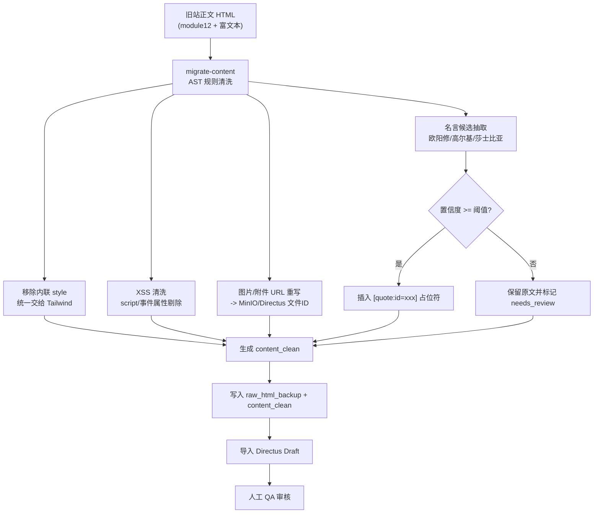

## 图 10: Publish/Revalidate Runtime（发布与重建链路）

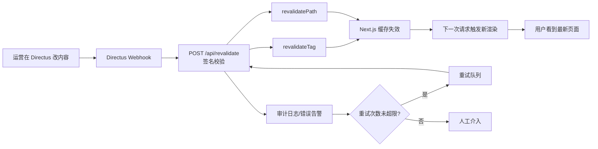

## 图 11: Release Guardrail & Rollback（发布护栏与回滚）

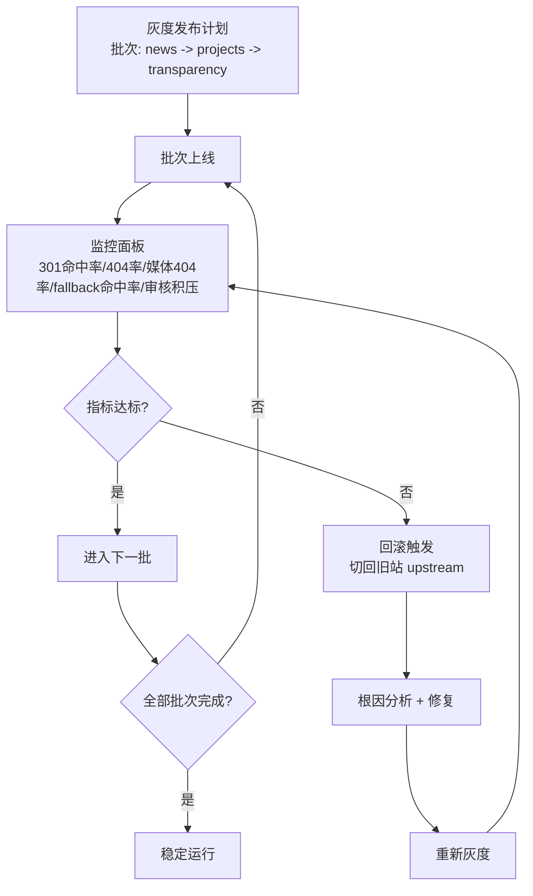

## 12) 接口、脚本与数据约束

- 关键 API：
  - `POST /api/revalidate`（签名校验 + 重试 + 审计）
  - `GET /api/legacy-resolve`（old_slug/legacy_url 兜底）
  - `GET /sitemap.xml`（动态 sitemap）
- 关键脚本：
  - `scripts/generate-redirects.ts`
  - `scripts/validate-redirects.ts`
  - `scripts/migrate-content.ts`
- 关键字段约束：
  - `old_slug`：同集合唯一
  - `migration_status`：`draft_raw/cleaned/needs_review/approved/published`
  - `raw_html_backup`：不可覆盖删除（审计保留）

## 13) 上线门禁（Go/No-Go）

- `redirect coverage = 100%`（664 条旧 URL 全覆盖）
- `301 单跳`（禁止链式跳转）
- `内容清洗 dry-run 通过`（阻断阈值内）
- `人工审核通过率达标`（仅 approved 才可发布）
- `灰度监控指标达标`（未达标立即回滚）

## 14) 备注与边界

- 必做链路: 301 重定向、`old_slug` 兜底、`/api/revalidate`、动态 sitemap、人工审核门禁。
- 二阶段可选: Meilisearch 检索、任务队列扩展、自动告警分级策略。
- 本文档作为实施蓝图，后续代码落地必须与图中接口和门禁保持一致。
