# 网页排版方式架构图（模块 ID 级）

- 数据来源: `reports/frontend_extract/frontend_file_manifest.tsv` 与 `reports/frontend_extract/layout_signature_mapping.tsv`
- 页面样本统计: index=1, col=39, nd=604, nr=21
- 栏目页签名数: 27（全覆盖）

## 1) 全站公共骨架

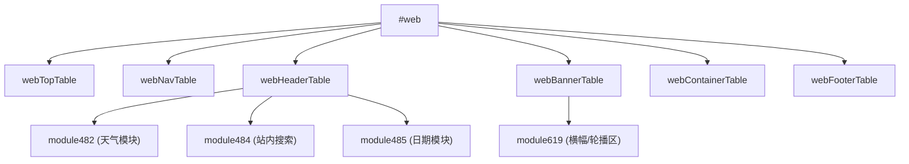

## 2) 首页模板（index）

### INDEX_SIG_01

- 覆盖页面数: 1
- 代表页面: `hctxf.org/index.html`
- 模块 ID: `428,431,432,433,482,484,485,506,507,509,510,515,516,517,518,519,520,521,522,523,524,525,526,527,528,529,530,532,533,534,535,536,583,586,587,588,589,590,598,599,600,619,620,623,624,625,632,633,634,635`

```mermaid
flowchart LR
  P["INDEX_SIG_01"]
  P --> M428["module428"]
  P --> M431["module431"]
  P --> M432["module432"]
  P --> M433["module433"]
  P --> M482["module482 (天气模块)"]
  P --> M484["module484 (站内搜索)"]
  P --> M485["module485 (日期模块)"]
  P --> M506["module506 (基金会动态区块)"]
  P --> M507["module507"]
  P --> M509["module509"]
  P --> M510["module510 (公益项目区块)"]
  P --> M515["module515"]
  P --> M516["module516"]
  P --> M517["module517"]
  P --> M518["module518"]
  P --> M519["module519"]
  P --> M520["module520"]
  P --> M521["module521"]
  P --> M522["module522"]
  P --> M523["module523"]
  P --> M524["module524"]
  P --> M525["module525"]
  P --> M526["module526"]
  P --> M527["module527"]
  P --> M528["module528"]
  P --> M529["module529"]
  P --> M530["module530"]
  P --> M532["module532"]
  P --> M533["module533"]
  P --> M534["module534"]
  P --> M535["module535"]
  P --> M536["module536"]
  P --> M583["module583"]
  P --> M586["module586"]
  P --> M587["module587"]
  P --> M588["module588"]
  P --> M589["module589"]
  P --> M590["module590"]
  P --> M598["module598"]
  P --> M599["module599"]
  P --> M600["module600"]
  P --> M619["module619 (横幅/轮播区)"]
  P --> M620["module620"]
  P --> M623["module623"]
  P --> M624["module624"]
  P --> M625["module625"]
  P --> M632["module632"]
  P --> M633["module633"]
  P --> M634["module634"]
  P --> M635["module635"]
```

## 3) 详情页模板（nd）

### ND_SIG_01

- 覆盖页面数: 604
- 代表页面: `hctxf.org/nd004c.html`
- 模块 ID: `12,449,482,484,485,619`

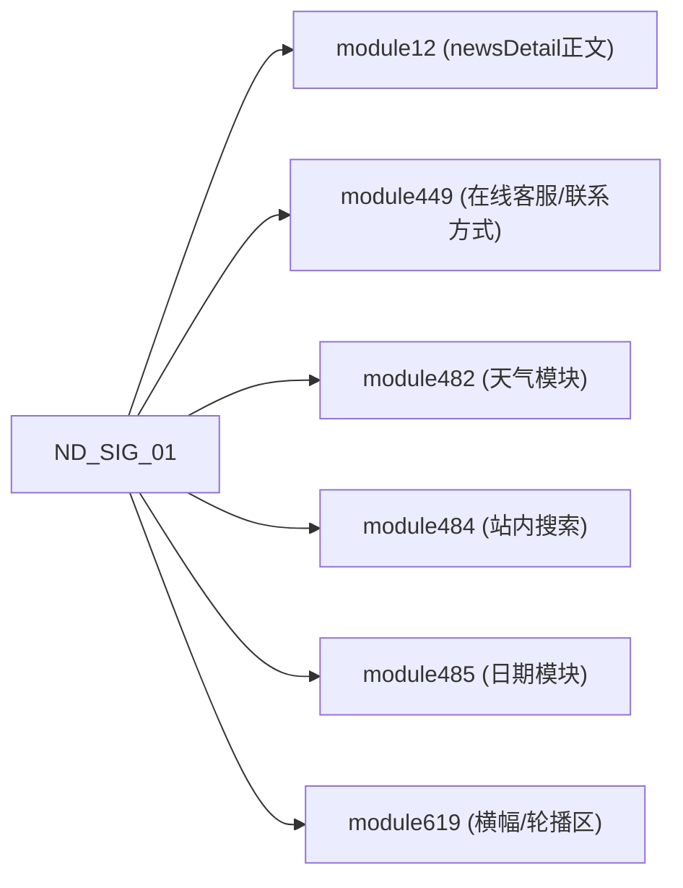

## 4) 列表页模板（nr）

### NR_SIG_01

- 覆盖页面数: 21
- 代表页面: `hctxf.org/nr.html`
- 模块 ID: `31,409,482,484,485,619`

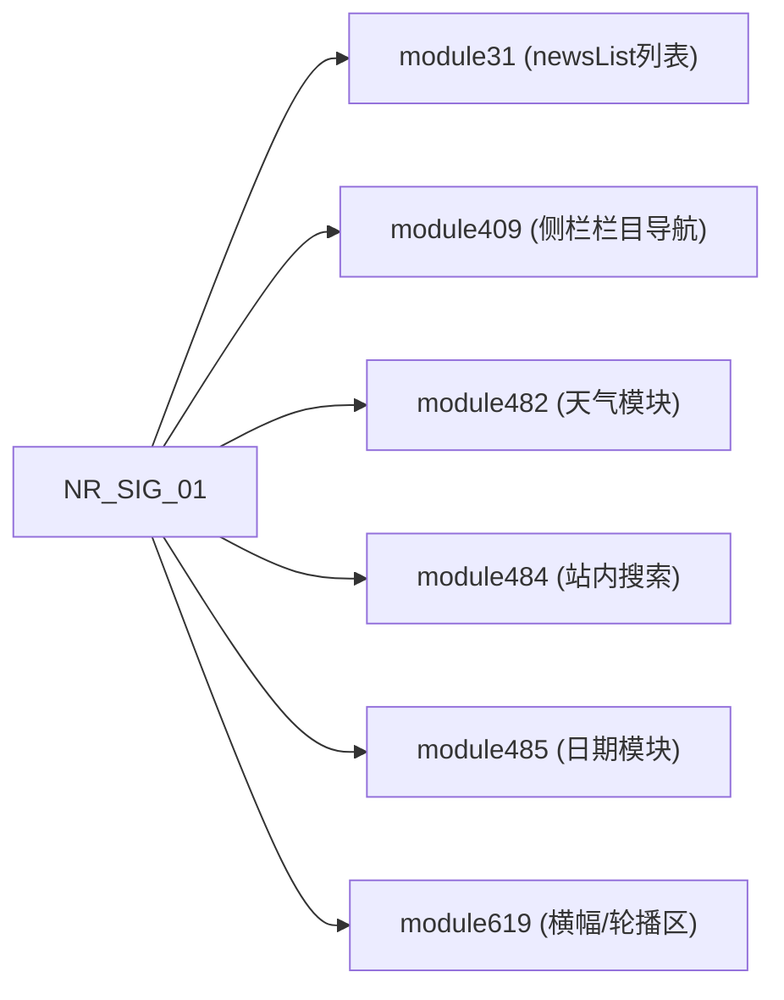

## 5) 栏目页模板（col，27 种签名全覆盖）

### COL_SIG_01

- 覆盖页面数: 7
- 代表页面: `hctxf.org/col0a4e.html`
- 模块 ID: `409,419,482,484,485,619`

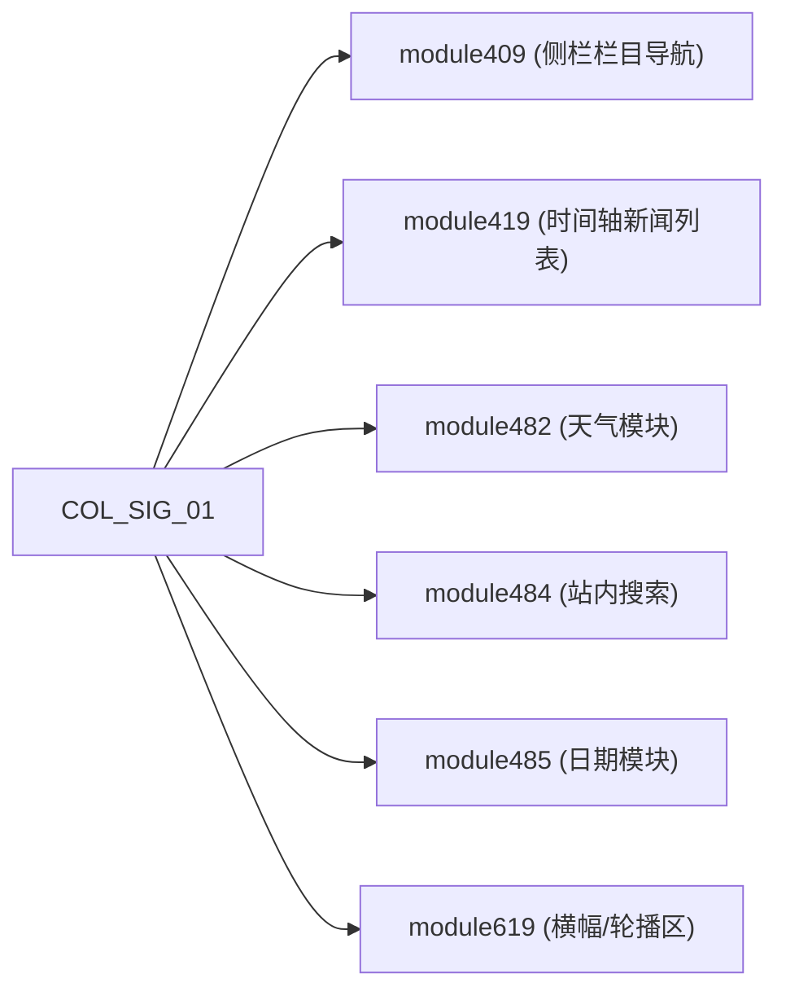

### COL_SIG_02

- 覆盖页面数: 7
- 代表页面: `hctxf.org/col1267.html`
- 模块 ID: `409,419,482,484,485`

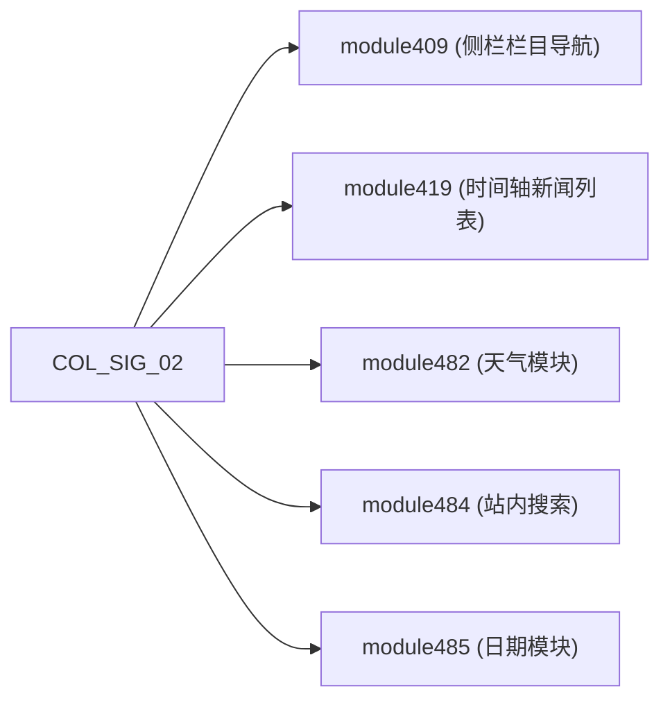

### COL_SIG_03

- 覆盖页面数: 1
- 代表页面: `hctxf.org/col004c.html`
- 模块 ID: `408,414,482,484,485`


### COL_SIG_04

- 覆盖页面数: 1
- 代表页面: `hctxf.org/col0717.html`
- 模块 ID: `409,420,482,484,485`

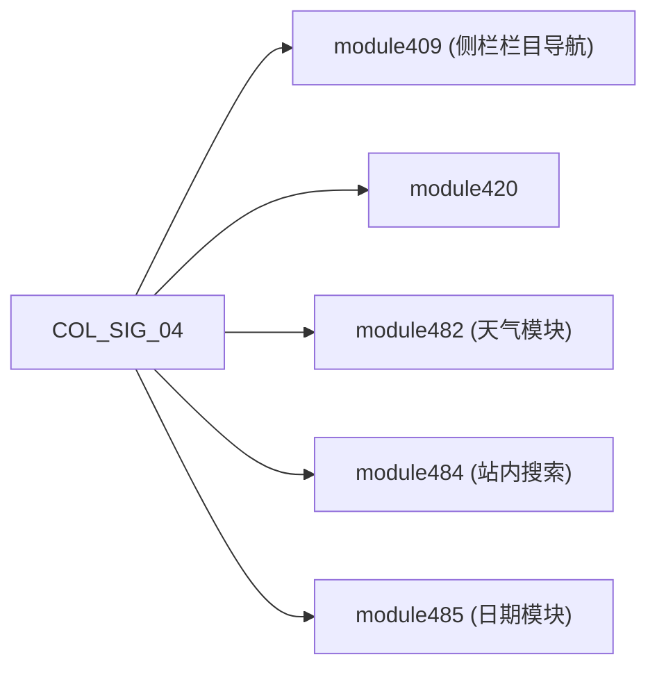

### COL_SIG_05

- 覆盖页面数: 1
- 代表页面: `hctxf.org/col09c3.html`
- 模块 ID: `410,460,482,484,485`


### COL_SIG_06

- 覆盖页面数: 1
- 代表页面: `hctxf.org/col0d7d.html`
- 模块 ID: `410,482,484,485,513`


### COL_SIG_07

- 覆盖页面数: 1
- 代表页面: `hctxf.org/col0f0e.html`
- 模块 ID: `411,445,482,484,485,619`

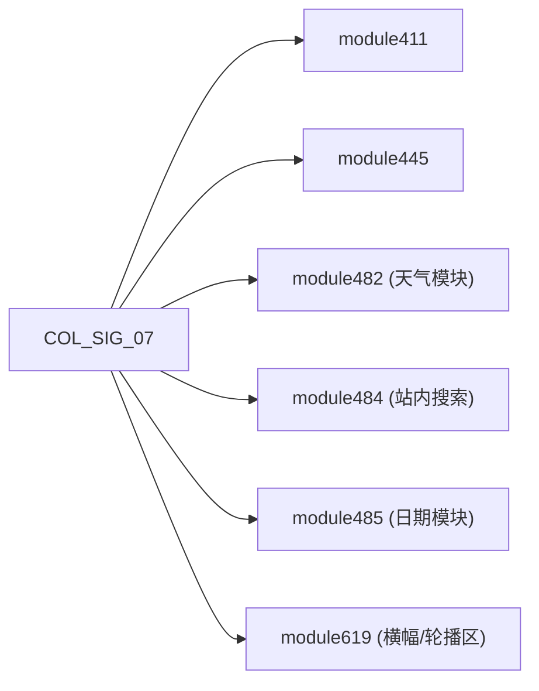

### COL_SIG_08

- 覆盖页面数: 1
- 代表页面: `hctxf.org/col132f.html`
- 模块 ID: `411,441,482,484,485,619`


### COL_SIG_09

- 覆盖页面数: 1
- 代表页面: `hctxf.org/col294f.html`
- 模块 ID: `450,482,484,485,514`

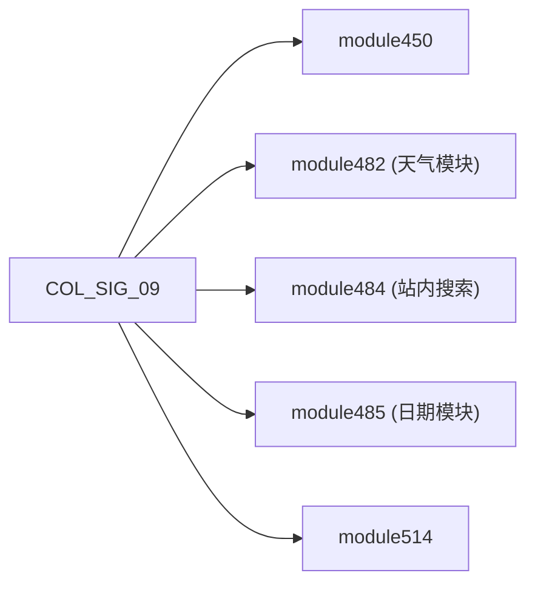

### COL_SIG_10

- 覆盖页面数: 1
- 代表页面: `hctxf.org/col39d7.html`
- 模块 ID: `482,484,485,619,656`

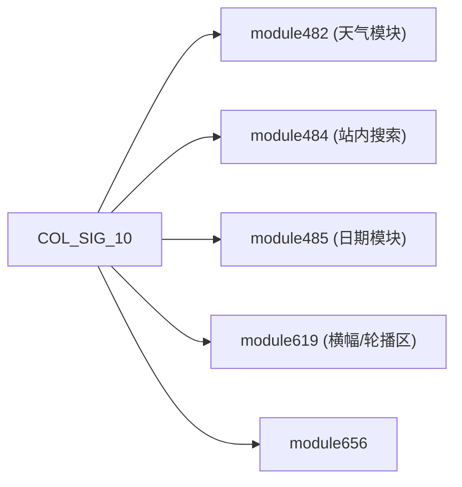

### COL_SIG_11

- 覆盖页面数: 1
- 代表页面: `hctxf.org/col3b75.html`
- 模块 ID: `411,482,484,485,545,548,556,557,558,559,560,561,562,563,619`

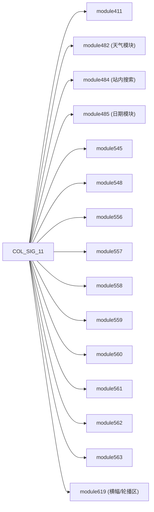

### COL_SIG_12

- 覆盖页面数: 1
- 代表页面: `hctxf.org/col4b61.html`
- 模块 ID: `410,440,482,484,485`


### COL_SIG_13

- 覆盖页面数: 1
- 代表页面: `hctxf.org/col4c30.html`
- 模块 ID: `408,421,453,482,484,485,619`

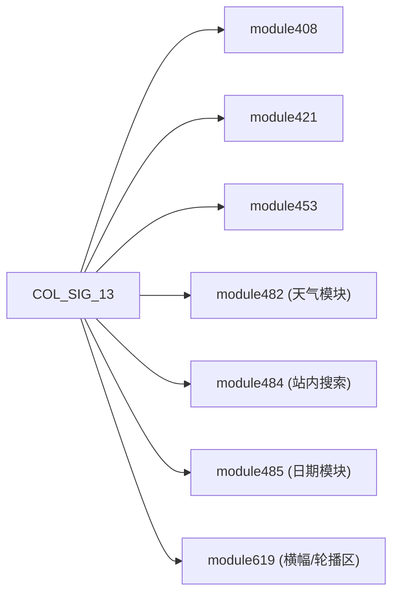

### COL_SIG_14

- 覆盖页面数: 1
- 代表页面: `hctxf.org/col5cee.html`
- 模块 ID: `410,461,482,484,485`


### COL_SIG_15

- 覆盖页面数: 1
- 代表页面: `hctxf.org/col64d0.html`
- 模块 ID: `408,415,482,484,485`

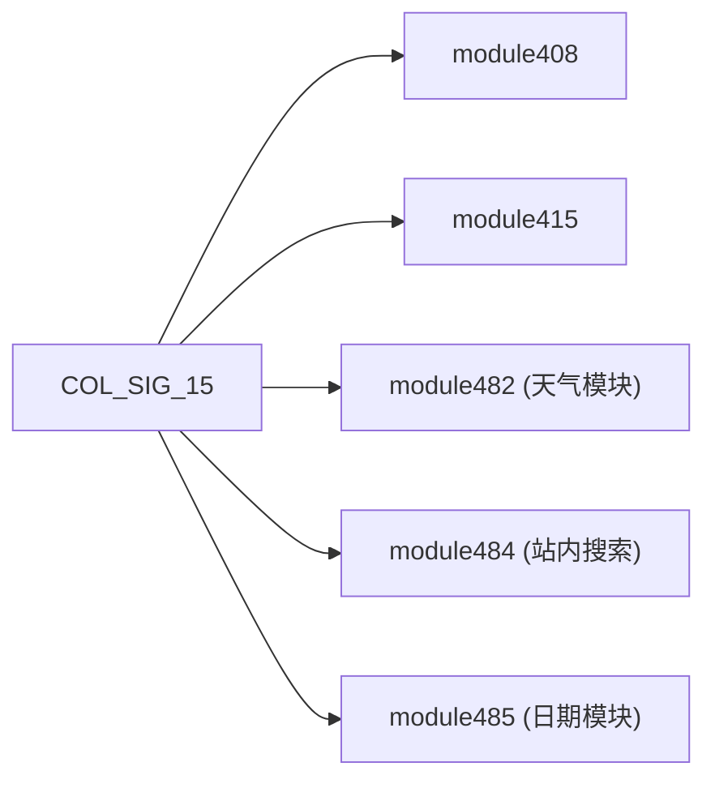

### COL_SIG_16

- 覆盖页面数: 1
- 代表页面: `hctxf.org/col686a.html`
- 模块 ID: `410,482,484,485,540`

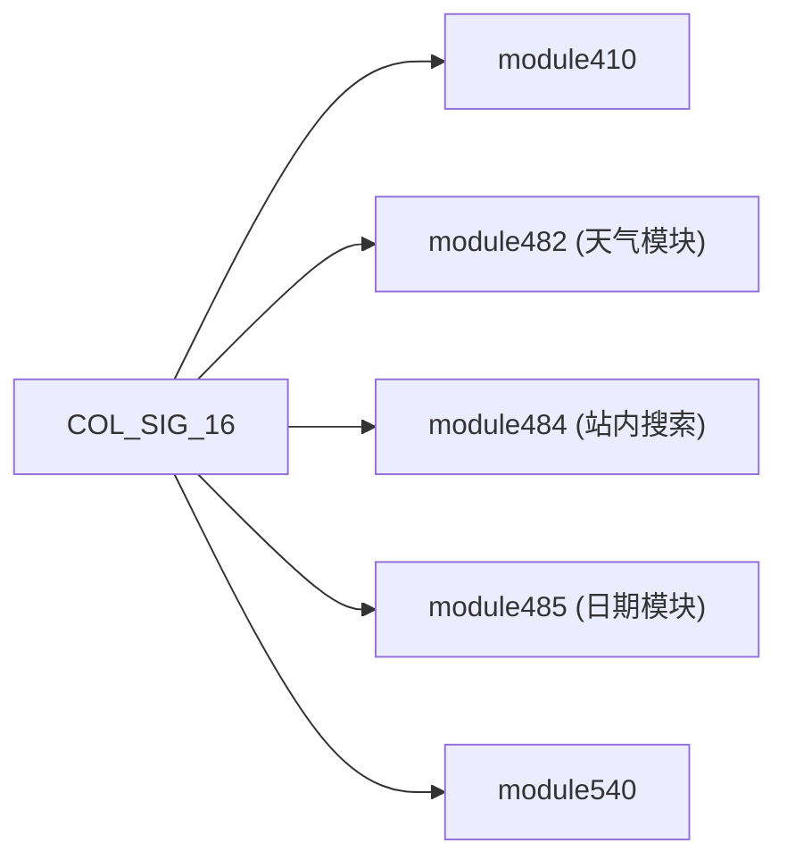

### COL_SIG_17

- 覆盖页面数: 1
- 代表页面: `hctxf.org/col6d44.html`
- 模块 ID: `482,484,485,537,542`

```mermaid
flowchart LR
  P["COL_SIG_17"]
  P --> M482["module482 (天气模块)"]
  P --> M484["module484 (站内搜索)"]
  P --> M485["module485 (日期模块)"]
  P --> M537["module537"]
  P --> M542["module542"]
```

### COL_SIG_18

- 覆盖页面数: 1
- 代表页面: `hctxf.org/col79ff.html`
- 模块 ID: `408,416,482,484,485`

```mermaid
flowchart LR
  P["COL_SIG_18"]
  P --> M408["module408"]
  P --> M416["module416"]
  P --> M482["module482 (天气模块)"]
  P --> M484["module484 (站内搜索)"]
  P --> M485["module485 (日期模块)"]
```

### COL_SIG_19

- 覆盖页面数: 1
- 代表页面: `hctxf.org/col97d4.html`
- 模块 ID: `410,454,482,484,485`

```mermaid
flowchart LR
  P["COL_SIG_19"]
  P --> M410["module410"]
  P --> M454["module454"]
  P --> M482["module482 (天气模块)"]
  P --> M484["module484 (站内搜索)"]
  P --> M485["module485 (日期模块)"]
```

### COL_SIG_20

- 覆盖页面数: 1
- 代表页面: `hctxf.org/col9bb2.html`
- 模块 ID: `408,417,482,484,485`

```mermaid
flowchart LR
  P["COL_SIG_20"]
  P --> M408["module408"]
  P --> M417["module417"]
  P --> M482["module482 (天气模块)"]
  P --> M484["module484 (站内搜索)"]
  P --> M485["module485 (日期模块)"]
```

### COL_SIG_21

- 覆盖页面数: 1
- 代表页面: `hctxf.org/cola262.html`
- 模块 ID: `482,484,485,601,602,603,619`

```mermaid
flowchart LR
  P["COL_SIG_21"]
  P --> M482["module482 (天气模块)"]
  P --> M484["module484 (站内搜索)"]
  P --> M485["module485 (日期模块)"]
  P --> M601["module601"]
  P --> M602["module602"]
  P --> M603["module603"]
  P --> M619["module619 (横幅/轮播区)"]
```

### COL_SIG_22

- 覆盖页面数: 1
- 代表页面: `hctxf.org/cola9d2.html`
- 模块 ID: `482,484,485,619,648,649`

```mermaid
flowchart LR
  P["COL_SIG_22"]
  P --> M482["module482 (天气模块)"]
  P --> M484["module484 (站内搜索)"]
  P --> M485["module485 (日期模块)"]
  P --> M619["module619 (横幅/轮播区)"]
  P --> M648["module648"]
  P --> M649["module649"]
```

### COL_SIG_23

- 覆盖页面数: 1
- 代表页面: `hctxf.org/colb4cd.html`
- 模块 ID: `411,442,482,484,485,619`

```mermaid
flowchart LR
  P["COL_SIG_23"]
  P --> M411["module411"]
  P --> M442["module442"]
  P --> M482["module482 (天气模块)"]
  P --> M484["module484 (站内搜索)"]
  P --> M485["module485 (日期模块)"]
  P --> M619["module619 (横幅/轮播区)"]
```

### COL_SIG_24

- 覆盖页面数: 1
- 代表页面: `hctxf.org/colbce2.html`
- 模块 ID: `408,482,484,485,541`

```mermaid
flowchart LR
  P["COL_SIG_24"]
  P --> M408["module408"]
  P --> M482["module482 (天气模块)"]
  P --> M484["module484 (站内搜索)"]
  P --> M485["module485 (日期模块)"]
  P --> M541["module541"]
```

### COL_SIG_25

- 覆盖页面数: 1
- 代表页面: `hctxf.org/colc17f.html`
- 模块 ID: `411,443,482,484,485,619`

```mermaid
flowchart LR
  P["COL_SIG_25"]
  P --> M411["module411"]
  P --> M443["module443"]
  P --> M482["module482 (天气模块)"]
  P --> M484["module484 (站内搜索)"]
  P --> M485["module485 (日期模块)"]
  P --> M619["module619 (横幅/轮播区)"]
```

### COL_SIG_26

- 覆盖页面数: 1
- 代表页面: `hctxf.org/colc7f4.html`
- 模块 ID: `482,484,485,619,650,651`

```mermaid
flowchart LR
  P["COL_SIG_26"]
  P --> M482["module482 (天气模块)"]
  P --> M484["module484 (站内搜索)"]
  P --> M485["module485 (日期模块)"]
  P --> M619["module619 (横幅/轮播区)"]
  P --> M650["module650"]
  P --> M651["module651"]
```

### COL_SIG_27

- 覆盖页面数: 1
- 代表页面: `hctxf.org/cold5b4.html`
- 模块 ID: `410,460,482,484,485,619`

```mermaid
flowchart LR
  P["COL_SIG_27"]
  P --> M410["module410"]
  P --> M460["module460"]
  P --> M482["module482 (天气模块)"]
  P --> M484["module484 (站内搜索)"]
  P --> M485["module485 (日期模块)"]
  P --> M619["module619 (横幅/轮播区)"]
```

## 6) 说明

- 本文档为离线镜像结构图，模块 ID 来源于页面 DOM 中 `id="moduleXXX"`。
- 站点共享骨架固定，差异主要发生在 `webContainerTable` 内部模块组合。
- 栏目页存在 27 种模块签名，已全部列出；详情页签名在样本中为单一模板。
